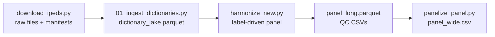

# IPEDS Paneling


## Table of Contents
1. [Project Description](#project-description)
2. [Installation](#installation)
3. [Usage](#usage)
4. [Features](#features)
5. [Contributing](#contributing)
6. [Technologies Used](#technologies-used)
7. [License](#license)
8. [Authors & Contact](#authors--contact)
9. [Troubleshooting / FAQ](#troubleshooting--faq)
10. [Known Issues](#known-issues)
11. [Bug Tracker](#bug-tracker)

---

## Project Description
IPEDS Paneling builds research-ready institution-level panels from the U.S. Department of Education’s IPEDS surveys. It merges dictionary metadata with survey files using a label-driven concept catalog, enforces parent/child policies, and emits long and wide datasets covering 2004–2024 (plus future years as released). The design follows best practices highlighted in IPEDS guidance, the Jaquette & Parra (2013) research playbook, and comparisons to StataIPEDSAll, prioritizing traceability and strict QC.

---

## Installation
```bash
git clone https://github.com/markjaysonfarol13/IPEDS_Paneling.git
cd IPEDS_Paneling
python3 -m venv .venv
source .venv/bin/activate
python -m pip install -U pip
python -m pip install -r requirements.txt
```

---

## Usage
High-level flow:



### 0. Download/refresh raw files & manifests
```bash
python download_ipeds.py \
  --out-root "/Users/markjaysonfarol13/Higher Ed research/IPEDS/Cross sectional Datas" \
  --years 2004:2024
```
This writes one manifest per year (now stored in `manifests/baseline/` for drift checking) and downloads every survey file plus dictionary, unzipping into the existing folder hierarchy. Use `--manifest-only` to scrape manifests without downloading payloads (the CI guard relies on this mode).

### 1. Build the dictionary lake
```bash
python 01_ingest_dictionaries.py \
  --root "/Users/markjaysonfarol13/Higher Ed research/IPEDS/Cross sectional Datas" \
  --output "/Users/markjaysonfarol13/Higher Ed research/IPEDS/Parquets/dictionary_lake.parquet"
```

### 2. Harmonize to a long panel (2004–2024+)
```bash
python harmonize_new.py \
  --root "/Users/markjaysonfarol13/Higher Ed research/IPEDS/Cross sectional Datas" \
  --lake "/Users/markjaysonfarol13/Higher Ed research/IPEDS/Parquets/dictionary_lake.parquet" \
  --years 2004:2024 \
  --output "/Users/markjaysonfarol13/Higher Ed research/IPEDS/Parquets/panel_long.parquet" \
  --rules validation_rules.yaml \
  --strict-release \
  --strict-coverage
```
*(Optional `--reporting-map reporting_map.csv` if you have a UNITID→reporting-unit crosswalk.)*

> **Note:** All parquet/CSV outputs are written under `/Users/markjaysonfarol13/Higher Ed research/IPEDS/...` to keep the Git repository code-only. Do not add generated artifacts to version control.

### 3. Pivot to the classic wide CSV
```bash
python panelize_panel.py \
  --source "/Users/markjaysonfarol13/Higher Ed research/IPEDS/Parquets/panel_long.parquet" \
  --output "/Users/markjaysonfarol13/Higher Ed research/IPEDS/Paneled Datasets/panel_wide.csv"
```
If you spin off supplemental scenarios, keep them under `/Users/markjaysonfarol13/Higher Ed research/IPEDS/Checks/Supp. Panels`.

### 4. Spot-check label matches
```bash
python - <<'PY'
import pandas as pd
df = pd.read_csv("label_matches.csv")
print(df.sort_values(["score", "year"]).head(10))
PY
```

---

## Features
- Label-driven harmonization with regex/exclude logic per concept.
- Parent/child reporting policies with explicit `reporting_unitid`.
- Strict release, coverage, uniform-form validations, plus CST 2024+ Cost analogs alongside legacy IC cost rows.
- Finance basis tagging (GASB/FASB/For-profit) per extracted row.
- EF residence long-family extraction with state column.
- QC outputs written outside the repo:
  - `label_matches.csv` → `/Users/markjaysonfarol13/Higher Ed research/IPEDS/Checks/Label match/`
  - `validation_report.csv`, `form_conflicts.csv`, `coverage_summary.csv` → `/Users/markjaysonfarol13/Higher Ed research/IPEDS/Checks/`
- Manifest drift guard workflow (`.github/workflows/manifest-drift.yml`) that scrapes current manifests in `--manifest-only` mode and fails PRs if they differ from the committed snapshot in `manifests/baseline/`. Update the baseline when you intentionally ingest new releases.

---

## Contributing
1. Fork and clone the repo.
2. Create a feature branch (`git checkout -b feature/my-update`).
3. Run lint/tests before committing.
4. Open a pull request describing the change.

---

## Technologies Used
- Python 3.13
- pandas, pyarrow
- Label-driven regex catalog
- CLI-driven workflows

---

## License
MIT License. See `LICENSE` for details.

---

## Authors & Contact
- **Mark Jayson Farol** – `markjaysonfarol13@gmail.com`  
- GitHub: [markjaysonfarol13](https://github.com/markjaysonfarol13)

---

## Troubleshooting / FAQ
- **OPEID merges?** Don’t aggregate on OPEID without a vetted crosswalk. See Robert Kelchen’s warning on OPEID pitfalls (Kelchen, *Beware OPEIDs and Super OPEIDs*, 2019). The harmonizer refuses `--scorecard-merge` unless you provide `--scorecard-crosswalk`.
- **Mixed forms in Finance?** Check `form_conflicts.csv`; ensure each UNITID-year uses a single Finance form (F1A vs F2A vs F3A).
- **Partial components (e.g., CST 2024)**? See `coverage_summary.csv` for per-year survey counts.

---

## Known Issues
- Early 2000s Finance forms sometimes use idiosyncratic wording; watch for low-scoring matches in `label_matches.csv`.
- 2024 components remain partial until NCES posts final Finance/SFA/CST files.

---

## Bug Tracker
Report issues via GitHub: <https://github.com/markjaysonfarol13/IPEDS_Paneling/issues>

---

## Build / Test Instructions
- **Build panel**: run steps in [Usage](#usage).
- **Tests**: run targeted smoke tests per instructions (no formal test suite yet); inspect QC files for anomalies.

## References
- **NCES IPEDS Survey Components**: <https://nces.ed.gov/ipeds/>
- **NCES Finance Overview**: <https://nces.ed.gov/ipeds/survey-components/2>
- **NCES Fall Enrollment Overview**: <https://nces.ed.gov/ipeds/survey-components/8>
- **Jaquette & Parra (2013)**: *The Handbook of Institutional Research* (Springer) – chapter on IPEDS research design.
- **Kelchen (2019)**: “Beware OPEIDs and Super OPEIDs” – IPEDS R&D Series.

--- *** End Patch
