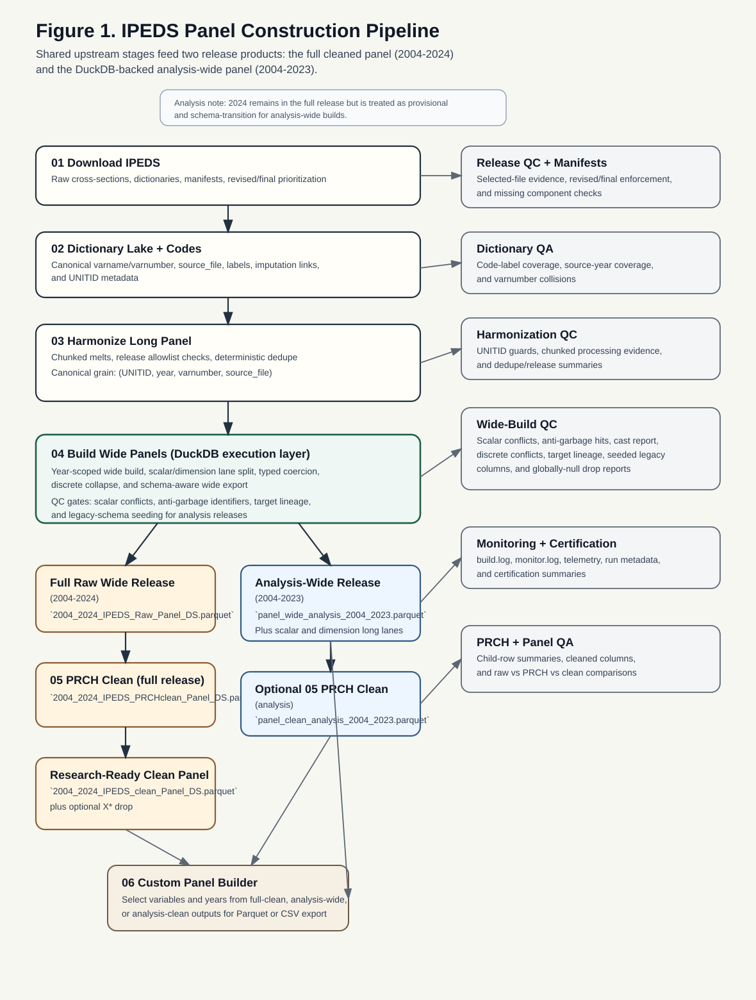

# IPEDS Paneling

Build reproducible IPEDS panel datasets from NCES cross-sections with strict release checks, harmonization guards, and analysis-wide exports.



## Overview

This repository supports two outputs:

- `Panels/2004_2024_IPEDS_clean_Panel_DS.parquet` (full cleaned panel, 2004-2024)
- `Panels/panel_wide_analysis_2004_2023.parquet` (analysis release window, 2004-2023 by default)

`2024` is treated as provisional/schema-transition for analysis-wide builds.

## Setup

```bash
python3 -m pip install -r requirements.txt
export IPEDS_ROOT="/path/to/IPEDS_Paneling"
```

Required input under `"$IPEDS_ROOT"`:

- `Raw_Cross_Section_Data/`

## Quick Start (Full Clean Panel)

```bash
bash manual_commands.sh
```

This runs `Scripts/00_run_all.py` and produces:

- `Panels/2004-2024/panel_long_varnum_2004_2024.parquet`
- `Panels/2004_2024_IPEDS_Raw_Panel_DS.parquet`
- `Panels/2004_2024_IPEDS_PRCHclean_Panel_DS.parquet`
- `Panels/2004_2024_IPEDS_clean_Panel_DS.parquet`

## Build Analysis-Wide Panel (Lane Split)

Run this after harmonization output exists:

```bash
python3 Scripts/04_build_wide_panel.py \
  --input "$IPEDS_ROOT/Panels/2004-2024/panel_long_varnum_2004_2024.parquet" \
  --out_dir "$IPEDS_ROOT/Panels/wide_analysis_parts" \
  --years "2004:2023" \
  --dictionary "$IPEDS_ROOT/Dictionary/dictionary_lake.parquet" \
  --lane-split \
  --dim-sources "C_A,C_B,C_C,CDEP,EAP,IC_CAMPUSES,IC_PCCAMPUSES,F_FA_F,F_FA_G" \
  --dim-prefixes "C_,EF,GR,GR200,SAL,S_,OM,DRV" \
  --exclude-vars "SPORT1,SPORT2,SPORT3,SPORT4" \
  --scalar-long-out "$IPEDS_ROOT/Panels/panel_long_scalar_unique.parquet" \
  --dim-long-out "$IPEDS_ROOT/Panels/panel_long_dim.parquet" \
  --wide-analysis-out "$IPEDS_ROOT/Panels/panel_wide_analysis_2004_2023.parquet" \
  --typed-output \
  --drop-empty-cols \
  --collapse-disc \
  --drop-disc-components \
  --qc-dir "$IPEDS_ROOT/Checks/wide_qc" \
  --disc-qc-dir "$IPEDS_ROOT/Checks/disc_qc"
```

## Custom Panel

```bash
python3 Scripts/06_build_custom_panel.py \
  --input "$IPEDS_ROOT/Panels/2004_2024_IPEDS_clean_Panel_DS.parquet" \
  --vars-file "Customize_Panel/selectedvars.txt" \
  --output "$IPEDS_ROOT/Panels/custom_panel.parquet"
```

## QA/QC Outputs

- `Checks/release_qc/` release-manifest validation and selected-file evidence
- `Checks/harmonize_qc/` missing-UNITID drop logs and harmonize summaries
- `Checks/disc_qc/` discrete-collapse conflicts and collapse map
- `Checks/wide_qc/qc_scalar_conflicts.csv` scalar-lane key conflicts
- `Checks/wide_qc/qc_anti_garbage_failures.csv` blocked dimension identifiers in wide targets
- `Checks/wide_qc/qc_cast_report.csv` typed-cast parse report
- `Checks/wide_qc/qc_globally_null_columns_dropped.csv` globally null columns removed post-build
- `Checks/prch_qc/` PRCH cleaning evidence

## Troubleshooting

- `zsh: parse error near ')'`:
  - Run commands from a `.sh` file or run `bash manual_commands.sh` directly.
- `ModuleNotFoundError: duckdb`:
  - Install dependencies in the active Python environment.
- `scalar conflict gate failed`:
  - Inspect `Checks/wide_qc/qc_scalar_conflicts.csv`; add true dimensioned sources/prefixes or exclude known problem vars.
- `anti-garbage gate failed`:
  - Inspect `Checks/wide_qc/qc_anti_garbage_failures.csv`; treat those variables as dimensioned or exclude them.

## Notes

- Keep generated large data out of git: `Raw_Cross_Section_Data/`, `Cross_sections/`, `Panels/`, `Checks/`.
- `UNITID` is documented in the dictionary as controlled metadata and also used as the panel key in harmonization.
